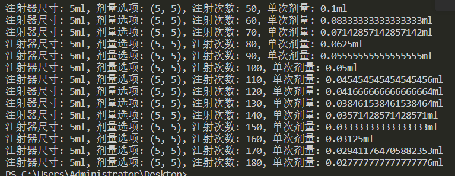

# 注射器剂量计算器

这个项目是一个简单的注射器剂量计算器，用于计算不同注射器尺寸、剂量选项和注射次数的组合下的单次剂量。

## 项目结构

- `main.py`：主要的Python代码文件，包含了注射器尺寸、剂量选项和注射次数的定义，以及计算单次剂量的函数和组合生成的代码。
- `README.md`：当前文件，包含了项目的说明文档。
- `screenshot.png`：运行截图的示例图片。

## 代码设计思路

1. 定义了三个列表变量：`注射器尺寸`、`剂量选项`和`注射次数`。
2. 编写了一个函数 `计算单次剂量`，用于计算单次剂量。
3. 使用三重嵌套循环生成不同注射器尺寸、剂量选项和注射次数的组合，并计算每种组合下的单次剂量。
4. 将组合和单次剂量输出到控制台。

## 运行截图

## 如何使用

1. 克隆本仓库到本地环境。
2. 打开终端或命令提示符，进入项目目录。
3. 运行 `main.py` 文件。
4. 查看输出结果，即不同组合下的单次剂量。

